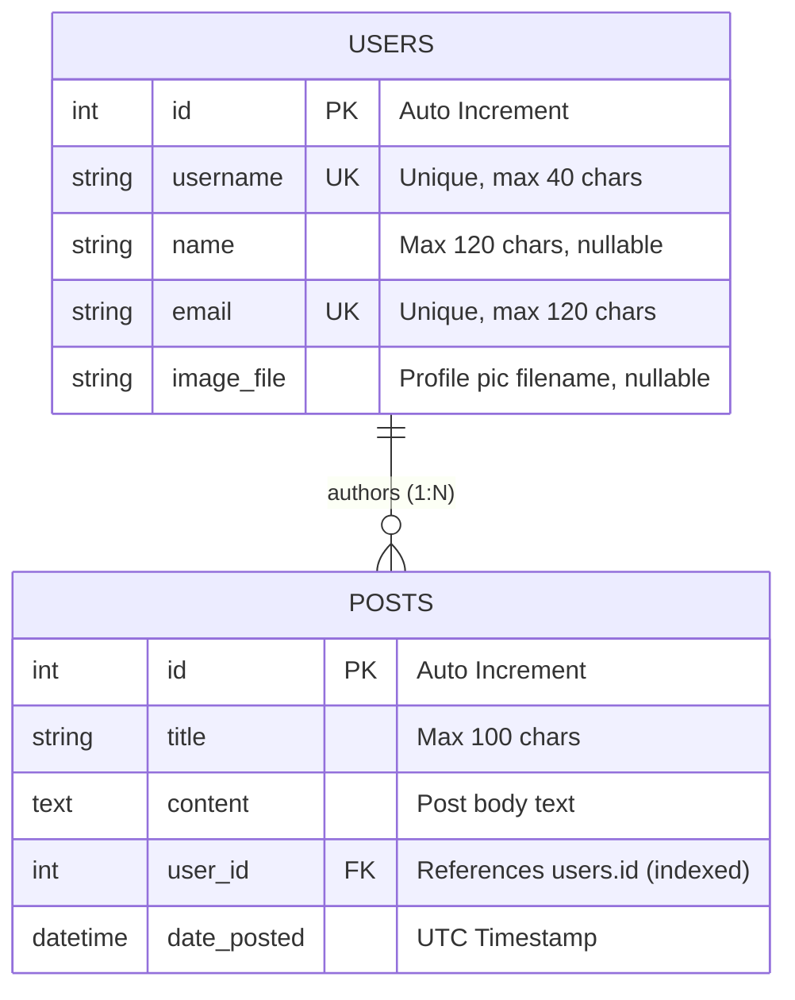

# 🚀 FastAPI Blog

A modern, full-stack blogging platform and RESTful API built with **FastAPI**, **SQLAlchemy 2.0**, **Pydantic v2**, and **Jinja2 Templates** styled with **Bootstrap 5**.

---

## 📖 Overview

**FastAPI Blog** demonstrates how to build a production-grade, hybrid web application using Python. It combines the speed and developer ergonomics of FastAPI for high-performance REST APIs with server-side rendered (SSR) dynamic web pages, complete with responsive styling and a dark/light theme switcher.

---

## ✨ Features

- ⚡ **High Performance REST API**: Full CRUD operations for Users and Posts with automatic OpenAPI documentation.
- 🎨 **Server-Side Rendered UI**: Clean, responsive frontend using Jinja2 templates and Bootstrap 5.
- 🌗 **Dark Mode & Theme Switcher**: Instant switching between Light, Dark, and System Auto themes with persistent `localStorage` support.
- 🗄️ **Relational Database with SQLAlchemy 2.0**: Typed `Mapped` columns, cascading deletions, and relationship mappings.
- 🛡️ **Pydantic v2 Data Validation**: Request data validation, email formatting checks, and schema response serialization.
- 🚦 **Intelligent Content-Aware Error Handling**: Dual-mode exception handlers that automatically return JSON responses for `/api/*` endpoints and friendly HTML error pages for browser views.
- 🖼️ **Static & Media File Serving**: Dynamic user avatar resolution with static defaults and media fallback handling.

---

## 🛠️ Tech Stack

| Component | Technology | Description |
| :--- | :--- | :--- |
| **Backend Framework** | [FastAPI](https://fastapi.tiangolo.com/) | High performance, async-ready Python web framework |
| **ORM & Database** | [SQLAlchemy 2.0](https://www.sqlalchemy.org/) + [SQLite](https://www.sqlite.org/) | Modern ORM with typed mapping and SQLite database |
| **Data Validation** | [Pydantic v2](https://docs.pydantic.dev/) | Fast data parsing, validation, and serialization |
| **Templating** | [Jinja2](https://palletsprojects.com/p/jinja/) | Server-side template engine for HTML rendering |
| **Frontend Styling** | [Bootstrap 5.3](https://getbootstrap.com/) + Custom CSS | Responsive layout, dark theme support, and typography |
| **Package Manager** | [uv](https://github.com/astral-sh/uv) | Ultra-fast Python package and project manager |

---

## 📁 Project Structure

```text
fastapi-blog/
├── .editorconfig              # Editor code styling rules
├── .gitignore                 # Git ignore rules
├── .python-version            # Target Python version (3.11+)
├── pyproject.toml             # Project configuration and dependencies
├── uv.lock                    # Dependency lockfile
├── README.md                  # Project documentation
└── src/
    └── fastapi_blog/
        ├── __init__.py        # Package initialization & CLI entrypoint
        ├── db.py              # Database engine, declarative base & session dependency
        ├── models.py          # SQLAlchemy ORM models (Users, Post)
        ├── schema.py          # Pydantic request & response schemas
        ├── main.py            # FastAPI application, routes, and exception handlers
        ├── media/             # User-uploaded files directory
        │   └── profile_pics/  # User profile pictures
        ├── static/            # Static assets (CSS, JS, default avatars)
        │   ├── css/
        │   │   └── main.css   # Custom CSS rules and theme variables
        │   ├── icons/
        │   └── profile_pics/  # Default profile avatars
        └── templates/         # Jinja2 HTML templates
            ├── base.html      # Base layout template (Navbar, Theme Switcher, Footer)
            ├── feed.html      # Main feed template
            ├── post.html      # Single post detail view & delete modal
            ├── user_posts.html# Filtered user posts feed
            └── error.html     # Custom error page
```

---

## 🗄️ Database Schema



---

## 🔌 API Endpoints Reference

### 👤 Users API

| Method | Endpoint | Description | Request Body | Response |
| :--- | :--- | :--- | :--- | :--- |
| `GET` | `/api/users` | List all registered users | None | `list[UserResponse]` |
| `POST` | `/api/users` | Register a new user | `UserCreate` | `UserResponse` (201 Created) |
| `GET` | `/api/users/{user_id}` | Get user details by ID | None | `UserResponse` |
| `PATCH` | `/api/users/{user_id}` | Partial update of user details | `UserUpdate` | `UserResponse` |
| `DELETE` | `/api/users/{user_id}` | Delete user (cascades to posts) | None | `204 No Content` |
| `GET` | `/api/users/{user_id}/posts` | Get all posts by a specific user | None | `list[PostResponse]` |

### 📝 Posts API

| Method | Endpoint | Description | Request Body | Response |
| :--- | :--- | :--- | :--- | :--- |
| `GET` | `/api/posts` | List all blog posts | None | `list[PostResponse]` |
| `POST` | `/api/posts` | Create a new blog post | `PostCreate` | `PostResponse` (201 Created) |
| `GET` | `/api/post/{post_id}` | Retrieve a post by ID | None | `PostResponse` |
| `PUT` | `/api/posts/{post_id}` | Full update of a blog post | `PostCreate` | `PostResponse` |
| `PATCH` | `/api/posts/{post_id}` | Partial update of a blog post | `PostUpdate` | `PostResponse` |
| `DELETE` | `/api/posts/{post_id}` | Delete a post by ID | None | `204 No Content` |

---

## 🌐 Web Pages & Routes

| URL Route | Template | Description |
| :--- | :--- | :--- |
| `/` or `/feed` | `feed.html` | Homepage showing all posts with author avatar, publication date, and snippet |
| `/post/{post_id}` | `post.html` | Detailed post view with author information and delete confirmation dialog |
| `/users/{user_id}/posts` | `user_posts.html` | Filtered list displaying all posts authored by a specific user |

---

## 🚀 Getting Started

### Prerequisites

- **Python 3.11+**
- [uv](https://github.com/astral-sh/uv) *(recommended)* or standard `pip`

---

### Option 1: Quickstart with `uv` (Recommended)

1. **Clone the repository**:
   ```bash
   git clone https://github.com/rahul-m-u/fastapi-blog.git
   cd fastapi-blog
   ```

2. **Install dependencies and sync environment**:
   ```bash
   uv sync
   ```

3. **Start the development server**:
   ```bash
   uv run fastapi dev src/fastapi_blog/main.py
   ```
   Or using Uvicorn directly:
   ```bash
   uv run uvicorn src.fastapi_blog.main:app --reload
   ```

---

### Option 2: Setup with Standard `venv` & `pip`

1. **Create and activate a virtual environment**:
   ```bash
   # Windows (PowerShell)
   python -m venv .venv
   .venv\Scripts\Activate.ps1

   # Linux / macOS
   python3 -m venv .venv
   source .venv/bin/activate
   ```

2. **Install dependencies**:
   ```bash
   pip install "fastapi[standard]>=0.141.1" "jinja2>=3.1.6" "sqlalchemy>=2.0.54"
   ```

3. **Run the server**:
   ```bash
   uvicorn src.fastapi_blog.main:app --reload
   ```

---

## 📚 Interactive API Documentation

Once the server is running, you can explore and test the interactive API docs directly in your browser:

- **Swagger UI**: [http://127.0.0.1:8000/docs](http://127.0.0.1:8000/docs)
- **ReDoc**: [http://127.0.0.1:8000/redoc](http://127.0.0.1:8000/redoc)
- **Web Application**: [http://127.0.0.1:8000/](http://127.0.0.1:8000/)

---

## 🔮 Roadmap & Upcoming Features

- [ ] **Authentication & Authorization**: User registration, login sessions, JWT tokens, and password hashing (`passlib` / `bcrypt`).
- [ ] **Media Uploads**: Profile picture file upload endpoints and validation.
- [ ] **Interactive Web Forms**: HTML forms for creating, editing, and deleting posts directly from the web interface.
- [ ] **Pagination & Search**: Query filtering, keyword search, and pagination for feeds and API lists.
- [ ] **Comments & Reactions**: Comment threads and post likes.

---

## 👤 Author

**Rahul M U**
- Email: [rahulmu51@gmail.com](mailto:rahulmu51@gmail.com)
- GitHub: [@rahul-m-u](https://github.com/rahul-m-u)

---

## 📄 License

This project is open-source and available under the [MIT License](LICENSE).
